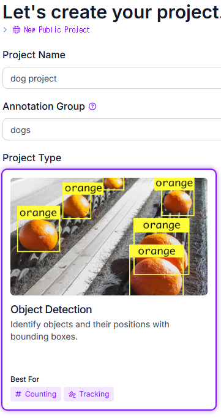
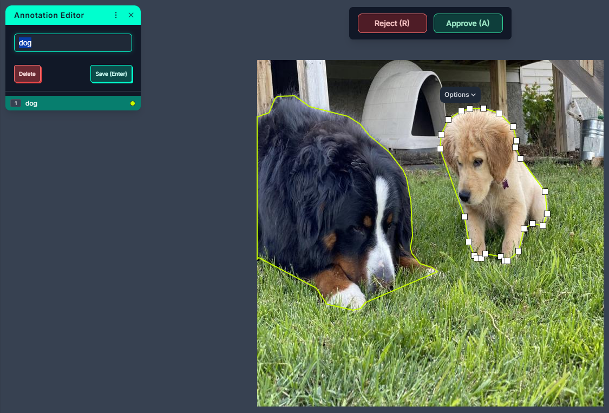
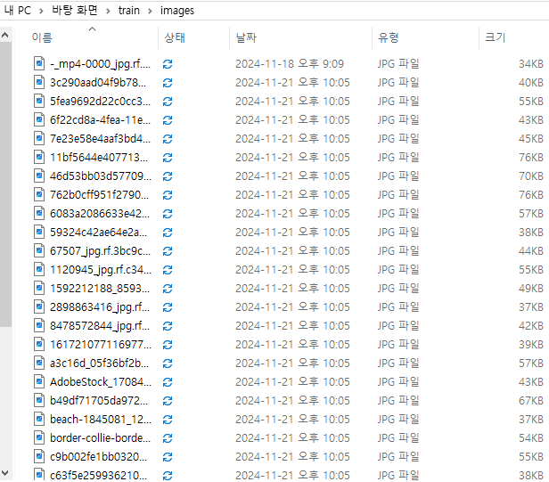
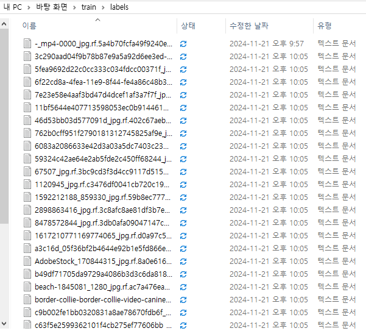
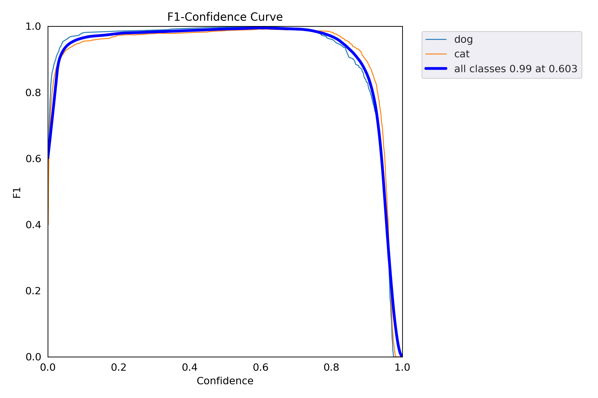
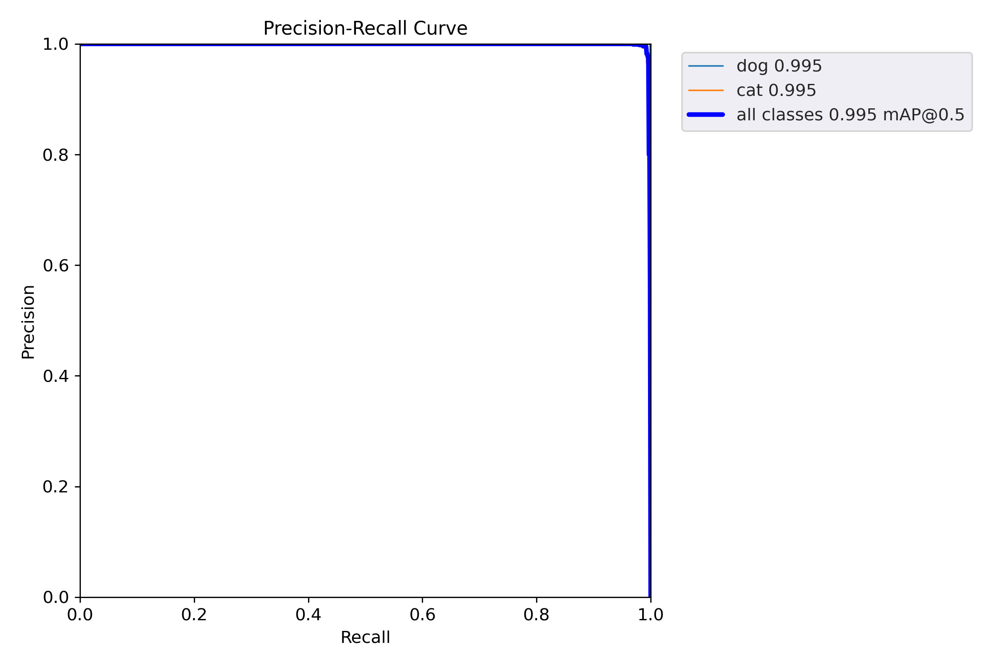
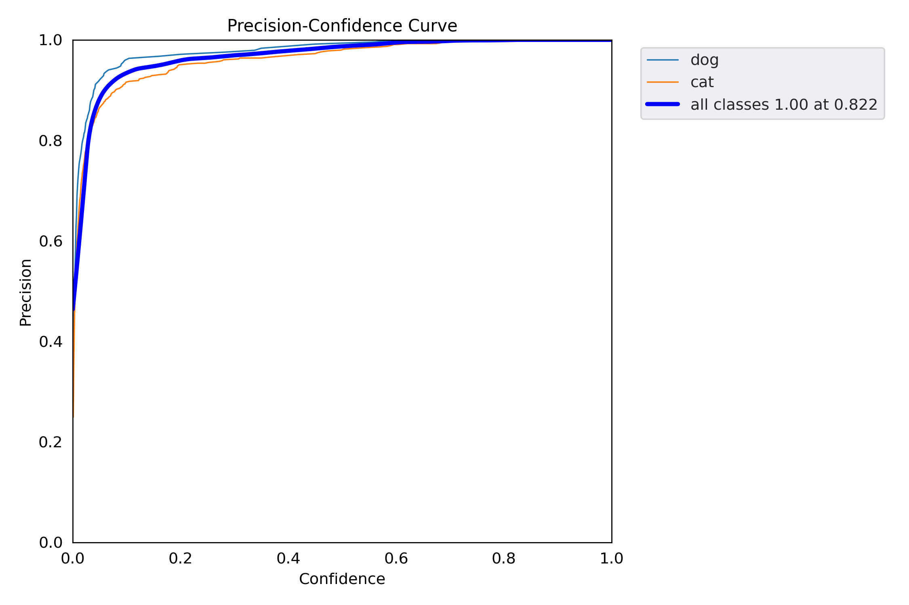
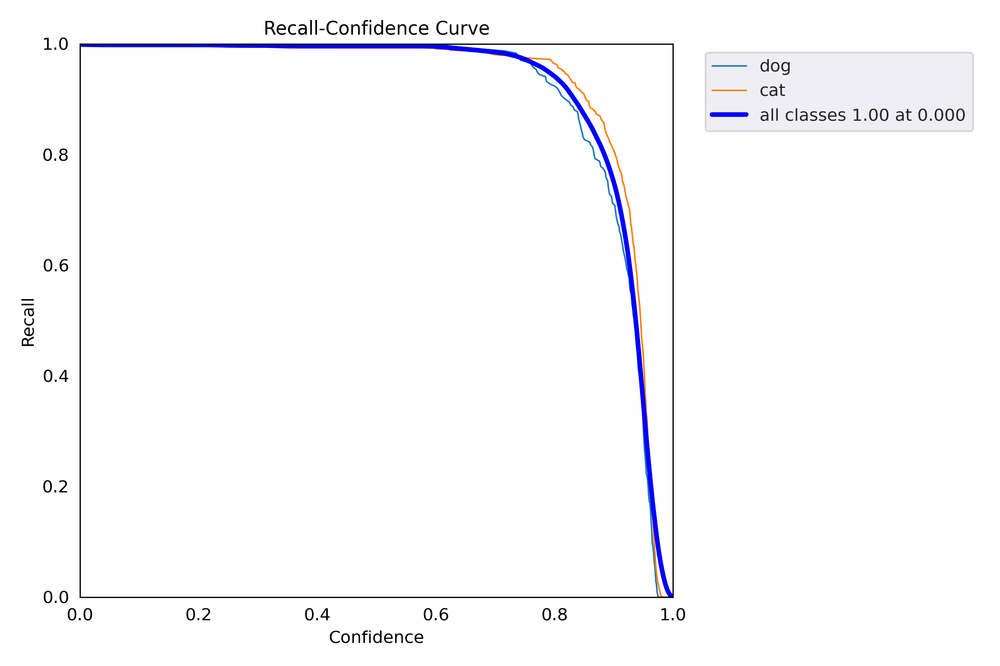
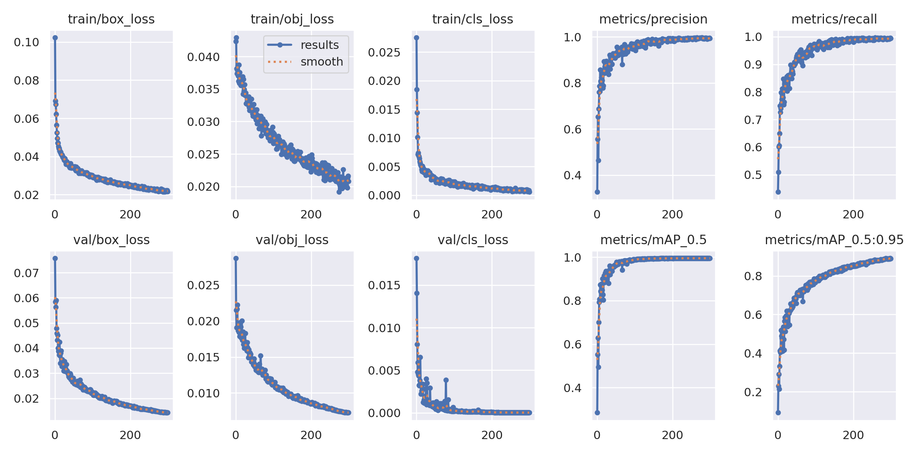
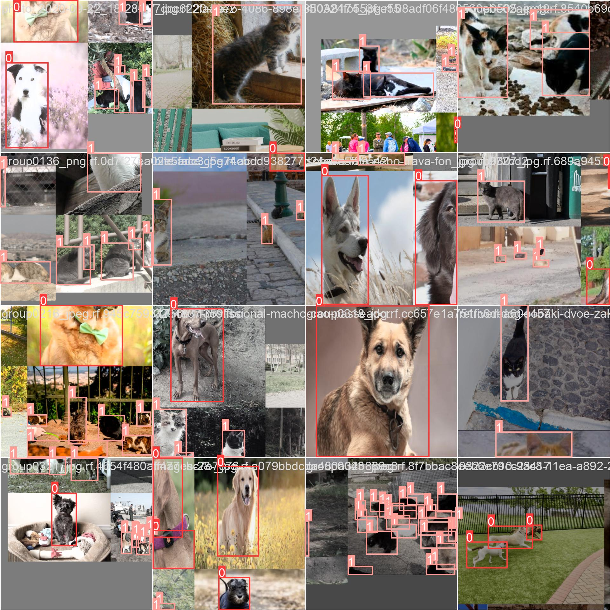

# YOLOv5-Based Animal Detection for Safer Autonomous Driving

---

## Overview

> **Project Background**
> 

> **Project Description**
> 

> **Data Acquisition Methods**
> 

> **Annotation process**
> 

> **YOLOv5 Training Process**
> 

> **Training Results**
> 

> **Significance of this Project**
> 

> **Faced Limitations**
> 

> **Discussion**
> 

---

## Project Background

<aside>
💬

**The autonomous driving market continues to grow, driven by increasing consumer demands for safety and efficiency. As a result, enhancing the accuracy and responsiveness of technologies utilizing LiDAR, radar, and cameras remains a critical challenge.**

</aside>

## **Project Description**

<aside>
💬

**This project utilizes YOLOv5 to develop a real-time animal detection system for autonomous vehicles. This system aims to detect animals such as dogs and cats, assisting the vehicle in adjusting its actions to avoid potential collisions. The process involves collecting data, labeling it, training a model, and testing its performance for accurate detection. Ultimately, the goal is to improve road safety by enabling autonomous vehicles to respond effectively to animals on the road.**

</aside>

## **Data Acquisition Methods**

<aside>
📷

**I recorded my pet with my phone and downloaded videos of dogs and cats from [Videvo](https://www.videvo.net/).**

[https://drive.google.com/drive/folders/1Dh0xd0Z7DzT_wSvgdRksRBRvK9Sk87Qp?usp=drive_link](https://drive.google.com/drive/folders/1Dh0xd0Z7DzT_wSvgdRksRBRvK9Sk87Qp?usp=drive_link)

</aside>

<aside>
💾

**I downloaded images of various breeds of cats and dogs from [Roboflow](https://roboflow.com/)**

[https://drive.google.com/drive/folders/1vd2TEx0XRxx6_SK336H9BihINHWTir3v?usp=sharing](https://drive.google.com/drive/folders/1vd2TEx0XRxx6_SK336H9BihINHWTir3v?usp=sharing)

</aside>

## Annotation process

<aside>
📋

### Creating a Project



**I appropriately named the project and set its type**

</aside>

<aside>
📋

### Labeling



**I used Roboflow to convert the video into images. Then, to train the model more accurately, I annotated the images with polygons instead of rectangles and set the appropriate classes for dogs and cats**

</aside>

<aside>
📋

### Check Files





**After completing the annotations, I verified that the images and text files were saved correctly without any missing files**

</aside>

## YOLOv5 Training Process

<aside>
📋

```python
**!git clone [https://github.com/ultralytics/yolov5](https://github.com/ultralytics/yolov5)
%cd yolov5
%pip install -qr requirements.txt**
```

**Clones the YOLOv5 repository from GitHub to your local machine and installs all the dependencies listed in the requirements.txt file.**

---

```python
**!pip install Pillow==10.3**
```

**Installs a specific version (10.3) of the Python library Pillow, which is used for image processing tasks**

---

```python
**!mkdir -p Train/labels
!mkdir -p Train/images
!mkdir -p Val/labels
!mkdir -p Val/images**
```

**Creates the `Train` and `Val` folders, along with their subfolders `images` and `labels`, providing storage space for images and text files.**

---

```python
**import os
import shutil
from sklearn.model_selection import train_test_split

def create_validation_set(train_path, val_path, split_ratio=0.3):
    os.makedirs(os.path.join(val_path, 'images'), exist_ok=True)
    os.makedirs(os.path.join(val_path, 'labels'), exist_ok=True)

    train_images = os.listdir(os.path.join(train_path, 'images'))
    train_images = [f for f in train_images if f.endswith(('.jpg', '.jpeg', '.png'))]

    _, val_images = train_test_split(train_images,
                                   test_size=split_ratio,
                                   random_state=42)

    for image_file in val_images:
        src_image = os.path.join(train_path, 'images', image_file)
        dst_image = os.path.join(val_path, 'images', image_file)
        shutil.copy2(src_image, dst_image)

        label_file = os.path.splitext(image_file)[0] + '.txt'
        src_label = os.path.join(train_path, 'labels', label_file)
        dst_label = os.path.join(val_path, 'labels', label_file)
        if os.path.exists(src_label):
            shutil.copy2(src_label, dst_label)

    print(f"Created validation set with {len(val_images)} images")

train_path = '/content/drive/MyDrive/yolov5/Train'
val_path = '/content/drive/MyDrive/yolov5/Val'

create_validation_set(train_path, val_path)**
```

**Use the `train_test_split()` function to split 30% of the data from the `Train`  into `Val`, and then print the number of image and label files in both the `Train`  and `Val` directories after the split.**

---

```python
**def check_dataset():
    train_path = '/content/drive/MyDrive/yolov5/Train'
    val_path = '/content/drive/MyDrive/yolov5/Val'

    train_images = len(os.listdir(os.path.join(train_path, 'images')))
    train_labels = len(os.listdir(os.path.join(train_path, 'labels')))

    val_images = len(os.listdir(os.path.join(val_path, 'images')))
    val_labels = len(oxs.listdir(os.path.join(val_path, 'labels')))

    print("Dataset status:")
    print(f"Train - Images: {train_images}, Labels: {train_labels}")
    print(f"Val - Images: {val_images}, Labels: {val_labels}")

check_dataset()**
```

**The `check_dataset()` function checks the number of image and label files in the `Train` and `Val` directories**

---

```python
**import torch
import os
from IPython.display 
import Image, clear_output**
```

**`import torch`: For tensor operations and deep learning with PyTorch.**

**`import os`: For managing files and directories.
`from IPython.display import Image, clear_output`: To display images and clear outputs in Colab.**

---

```python
**import numpy as np
import tensorflow as tf
import os
from PIL import Image
from tensorflow.python.eager.context import eager_mode

def _preproc(image, output_height=512, output_width=512, resize_side=512):
    with eager_mode():
        h, w = image.shape[0], image.shape[1]
        scale = tf.cond(tf.less(h, w), lambda: resize_side / h, lambda: resize_side / w)
        resized_image = tf.compat.v1.image.resize_bilinear(tf.expand_dims(image, 0), [int(h*scale), int(w*scale)])
        cropped_image = tf.compat.v1.image.resize_with_crop_or_pad(resized_image, output_height, output_width)
        return tf.squeeze(cropped_image)

def Create_npy(imagespath, imgsize, ext) :
    images_list = [img_name for img_name in os.listdir(imagespath) if
                os.path.splitext(img_name)[1].lower() == '.'+ext.lower()]
    calib_dataset = np.zeros((len(images_list), imgsize, imgsize, 3), dtype=np.float32)

    for idx, img_name in enumerate(sorted(images_list)):
        img_path = os.path.join(imagespath, img_name)
        try:
            if os.path.getsize(img_path) == 0:
                print(f"Error: {img_path} is empty.")
                continue

            img = Image.open(img_path)
            img = img.convert("RGB") 
            img_np = np.array(img)

            img_preproc = _preproc(img_np, imgsize, imgsize, imgsize)
            calib_dataset[idx,:,:,:] = img_preproc.numpy().astype(np.uint8)
            print(f"Processed image {img_path}")

        except Exception as e:
            print(f"Error processing image {img_path}: {e}")

    np.save('calib_set.npy', calib_dataset)**
```

**Preprocesses images by resizing and central-cropping them, then saves the processed images as a NumPy array in the `calib_set.npy` file.**

---

```python
**Create_npy('/content/drive/MyDrive/yolov5/Train/images', 512, 'jpg')**
```

**Loads and processes images from `/content/drive/MyDrive/yolov5/Train/images` into 512x512 size, saving them as a NumPy array in `calib_set.npy`.**

---

```python
**!python train.py --img 512 --batch 16 --epochs 300 --data /content/drive/MyDrive/yolov5/data.yaml --weights yolov5n.pt --cache**
```

**Trains a YOLOv5 model with the following parameters:**

- **`--img 512`: Input image size of 512x512 pixels.**
- **`--batch 16`: Batch size of 16 images per training step.**
- **`--epochs 300`: Train for 300 epochs.**
- **`--data /content/drive/Mydrive/yolov5/data.yaml`: Specifies the dataset configuration file.**
- **`--weights yolov5n.pt`: Starts training with pre-trained weights from `yolov5n.pt`.**
- **`--cache`: Caches images for faster data loading during training.**

---

```python
**%load_ext tensorboard
%tensorboard --logdir runs**
```

**`%load_ext tensorboard`: Loads TensorBoard extension.
`%tensorboard --logdir runs`: Launches TensorBoard to view logs from the runs directory**

---

```python
**!python detect.py --weights /content/drive/MyDrive/yolov5/runs/train/exp/weights/best.pt --img 512 --conf 0.1 --source /content/drive/MyDrive/dog.mp4**
```

**Uses the trained model (`best.pt`) to perform object detection on the video `dog.mp4`, with a resolution of 512 and a confidence threshold of 0.1.**

---

</aside>

## **Training Results**

<aside>
📋

[https://drive.google.com/drive/folders/1EXorwSwcuytMRyNO9RDN6n_Bs4zD4ZcA?usp=drive_link](https://drive.google.com/drive/folders/1EXorwSwcuytMRyNO9RDN6n_Bs4zD4ZcA?usp=drive_link)

### 📊C**onfusion_matrix**

.png)

### 📊**F1_curve**



### 📊**PR_curve**



### 📊L**abels**


### 📊**P_curve**



### 📊**R_curve**



### 📊R**esult**



### 📊**Train_batch**



### 📋**detect.py execution videos**

[https://drive.google.com/drive/folders/1pzZ6P4oq56Pmb_9vfQQ04OOpQF0ULPxG?usp=drive_link](https://drive.google.com/drive/folders/1pzZ6P4oq56Pmb_9vfQQ04OOpQF0ULPxG?usp=drive_link)

### 📊**Val_batch**

.jpg)

### 📋**detect.py execution images**

[https://drive.google.com/drive/folders/1VQJ1qoCkoHAyNpvtDKmNL90mSEa3USHk?usp=sharing](https://drive.google.com/drive/folders/1VQJ1qoCkoHAyNpvtDKmNL90mSEa3USHk?usp=sharing)

</aside>

## **Significance of this Project**

<aside>
📋

**Collisions with animals pose risks to both humans and wildlife. This project uses YOLOv5 for real-time animal detection, improving autonomous driving safety and reducing accidents. By addressing this critical need, the project supports safer roads and sustainable human-wildlife coexistence.**

</aside>

## **Faced Limitations**

<aside>
📋

**Key limitations included Inadequate animal datasets, high computational demands for training, and detection difficulties in low-light or occluded environments.**

</aside>

## Discussion

<aside>
📋

**Future research directions include: expanding the dataset with diverse animal images from various environments to improve model generalization; integrating thermal cameras and infrared imaging for better detection in low-light and occluded conditions; optimizing the model for improved computational efficiency and real-time performance; and combining data from cameras, LiDAR, and radar for more accurate animal detection.**

</aside>